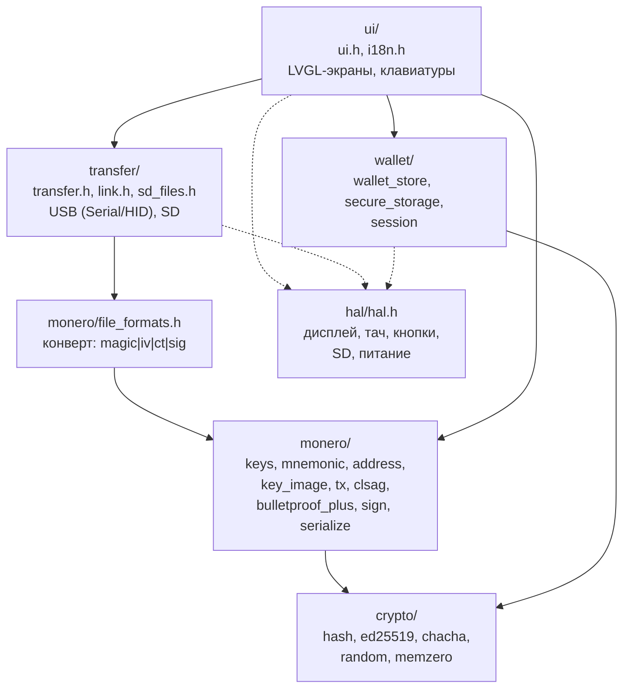
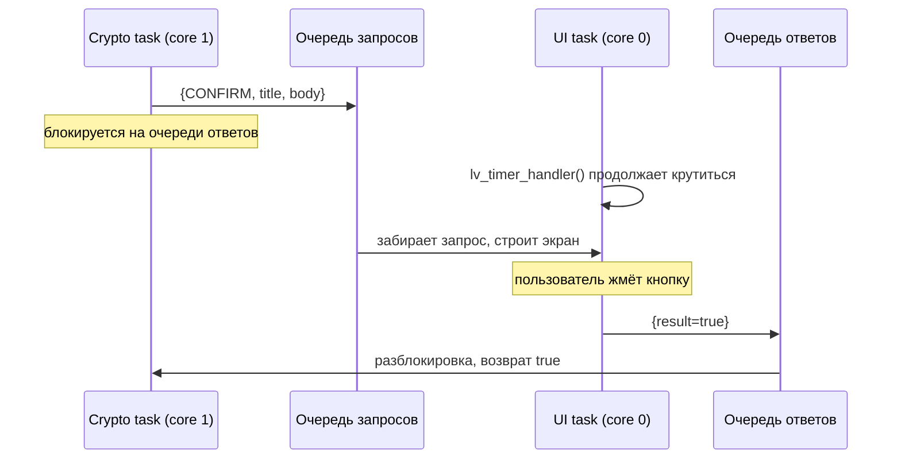
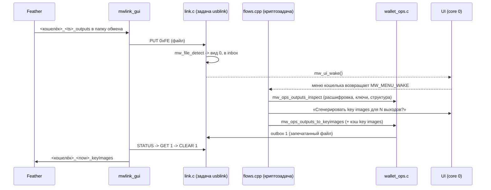
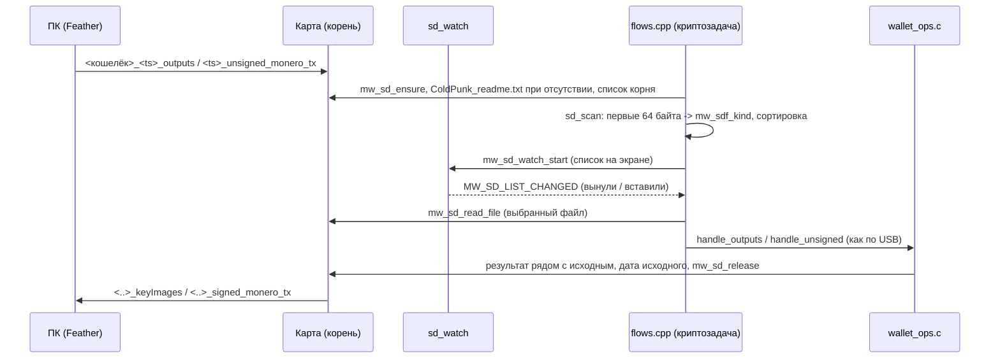

# Архитектура

Документ описывает слои прошивки, разделение задач FreeRTOS, бюджет памяти и
потоки данных двух основных операций. Всё, что утверждается про код,
опирается на заголовки в `src/` — они заморожены; реализация может отставать.

---

## 1. Слои



Основная вертикаль — слева направо по ТЗ:

```
обмен данными  ->  форматы файлов  ->  ядро Monero  ->  криптоядро
(transfer/)        (file_formats.h)    (monero/)        (crypto/)
```

HAL и UI стоят сбоку: HAL снизу обслуживает все слои, которым нужно железо,
UI сверху дирижирует сценариями.

### Правила зависимостей

| Слой | Может зависеть от | Не может |
| :--- | :--- | :--- |
| `crypto/` | только libc | всего остального |
| `data/` | `crypto/` (нет), только `wordlist.h` | Arduino, HAL |
| `monero/` | `crypto/`, `data/` | HAL, UI, transfer |
| `wallet/` | `monero/`, HAL (NVS/eFuse) | UI |
| `transfer/` | `monero/`, `wallet/secure_storage.h`, HAL | UI |
| `ui/` | всё | — |

Практическое следствие этого правила: `crypto/`, `monero/`, `data/` и
`transfer/ur.c` компилируются обычным `gcc` на хосте — именно этот набор
перечислен в `CORE_SRC` в `tools/test/Makefile`. Всё, что тянет Arduino или
железо, из хостовой сборки исключено.

### Платформозависимость

Единственная точка, где живут пины и флаги платы, — `boards/*.h`
(`BOARD_CONFIG_H`). Автоопределение платы не используется (ТЗ 2.1).
Всё остальное обращается к железу только через `src/hal/hal.h`, а
возможности платы читает из `mw_hal_caps()`.

---

## 2. Задачи FreeRTOS

Разделение задано в `src/config/app_config.h`:

| Задача | Ядро | Приоритет | Стек | Что делает |
| :--- | :--- | :--- | :--- | :--- |
| UI | `MW_UI_TASK_CORE` = 0 | `MW_UI_TASK_PRIO` = 2 | `MW_UI_TASK_STACK` = 8192 | `lv_timer_handler()`, опрос тача/кнопок, отрисовка |
| Crypto | `MW_CRYPTO_TASK_CORE` = 1 | `MW_CRYPTO_TASK_PRIO` = 3 | `MW_CRYPTO_TASK_STACK` = 32768 | оболочка `mw_shell_run()`: игра, пароль, меню, разбор файлов, key images, Bulletproofs+, CLSAG |
| `sd_watch` | любое | 1 | 8192 | только пока открыт список **SD card files**: раз в 500 мс проверяет карту (сырое чтение сектора 0, мимо кэша FAT; пин детекта, если он есть на плате), при извлечении размонтирует, при установке монтирует; сам завершается после первого изменения |

Цель разделения (ТЗ 4.1): пока криптозадача считает Bulletproofs+ несколько
секунд, экран продолжает перерисовываться, и заявленные ≥ 20 FPS
(`MW_TARGET_FPS`) и отклик < 100 мс (`MW_MAX_INPUT_LATENCY_MS`) не
нарушаются.

### Рукопожатие через очереди

`src/ui/ui.h` объявляет три функции, вызываемые **из криптозадачи**, но
исполняемые задачей LVGL:

```c
bool mw_ui_confirm(const char* title, const char* body,
                   const char* ok, const char* cancel);
void mw_ui_message(const char* title, const char* body);
void mw_ui_progress(const char* title, int permille, const char* detail);
```

Комментарий в заголовке: «Blocking helpers driven from the crypto task via a
queue». Схема:



Прогресс идёт в одну сторону и не блокирует: `mw_ui_progress` посылает
`permille` в очередь и возвращается немедленно. Именно к этому подключены
колбэки прогресса из криптоядра:

- `mw_bpp_set_progress_cb(cb, user)` — `src/monero/bulletproof_plus.h`,
  `permille` 0..1000 во время генерации range proof;
- `mw_sign_progress_cb(stage, permille, user)` — `src/monero/sign.h`,
  добавляет стадию (`MW_SIGN_STAGE_PARSE` … `MW_SIGN_STAGE_DONE`).

### Что где обязано выполняться

| Операция | Задача | Почему |
| :--- | :--- | :--- |
| `lv_timer_handler`, `mw_ui_tick` | UI | LVGL не потокобезопасен без блокировки |
| `mw_hal_*` дисплей/тач | UI | те же шины, что у LVGL |
| `mw_sign_transaction` | Crypto | секунды-минуты счёта |
| `mw_key_image_from_output` в цикле | Crypto | до 1000 записей |
| `mw_cn_slow_hash` | Crypto | 2 МБ доступов к PSRAM |
| `mw_kb_run` | UI | это экран |

---

## 3. Бюджет памяти (ESP32-S3, 8 МБ PSRAM)

ESP32-S3 даёт ~512 КБ внутреннего SRAM (из которых прошивке доступно
заметно меньше) и 8 МБ внешнего PSRAM. Принцип распределения: всё большое и
не критичное по задержке — в PSRAM; всё секретное и мелкое — во внутреннем
SRAM.

### Крупные потребители

| Потребитель | Объём | Где | Источник |
| :--- | :--- | :--- | :--- |
| Scratchpad `cn_slow_hash` | 2 МиБ непрерывно | PSRAM, обязательно | `chacha.h`: «needs a 2 MiB scratchpad… MUST come from PSRAM (TZ 1.4)» |
| Генераторы и рабочие векторы Bulletproofs+ | зависит от `MW_BPP_MAX_MN` = 16·64 = 1024 элементов на сторону | PSRAM | `bulletproof_plus.h`: «generator tables and the working vectors are allocated from PSRAM» |
| Буфер отрисовки LVGL | зависит от ширины экрана и числа строк в буфере | внутренний SRAM предпочтительно (DMA) | ТЗ 4.1 |
| Буферы файлов обмена | до 1000 записей выходов | PSRAM | `MW_MAX_EXPORTED_OUTPUTS` = 1000, ТЗ 11.3 |
| Модель транзакции `mw_transaction_t` | фиксированная, см. ниже | PSRAM или стек криптозадачи | `tx.h` |

### Почему scratchpad выделяется один раз при старте

```c
int mw_cn_slow_hash_init(void);   // pre-allocates the 2 MiB scratchpad once at boot
void mw_cn_slow_hash_free(void);
```

Комментарий в `chacha.h` прямо говорит зачем: «so signing never fails on a
late allocation». Если 2 МиБ непрерывного PSRAM не удастся выделить в
середине подписи из-за фрагментации, операция провалится в самый неудобный
момент. Поэтому память резервируется на старте и живёт всё время работы.

Следствие: из 8 МБ PSRAM 2 МиБ заняты постоянно. Оставшиеся ~6 МБ делят
LVGL (если буфер отрисовки в PSRAM), генераторы Bulletproofs+, буферы
файлов и кучу.

### Фиксированные пределы структур

Эти числа заданы заголовками и ограничивают потребление памяти сверху —
парсер обязан их проверять, чтобы вредоносный файл не разнёс кучу
(`tx.h`: «the limits below are the hard caps enforced by the parser so a
malformed file can never blow the heap»).

| Константа | Значение | Заголовок |
| :--- | :--- | :--- |
| `MW_MAX_INPUTS` | 16 | `monero/tx.h` |
| `MW_MAX_OUTPUTS` | 16 | `monero/tx.h` |
| `MW_MAX_DESTINATIONS` | 16 | `monero/tx.h` |
| `MW_RING_SIZE` / `MW_MAX_RING_SIZE` | 16 / 32 | `monero/tx.h` |
| `MW_MAX_TX_EXTRA` | 1024 | `monero/tx.h` |
| `MW_BPP_MAX_OUTPUTS` / `MW_BPP_MAX_M` | 16 / 16 | `monero/bulletproof_plus.h` |
| `MW_BPP_N` / `MW_BPP_MAX_MN` / `MW_BPP_MAX_LOG_MN` | 64 / 1024 / 10 | `monero/bulletproof_plus.h` |
| `MW_MAX_EXPORTED_OUTPUTS` | 1000 | `monero/file_formats.h` |
| `MW_MAX_KEYIMAGE_RECORDS` | 1000 | `config/app_config.h` |
| `MW_UR_MAX_PARTS` | 512 | `transfer/ur.h` |
| `MAX_WALLETS` | 10 | `config/app_config.h` |

Грубая оценка `mw_transaction_t`: 16 входов × (кольцо 32 × 64 байта +
служебное) — порядка 40 КБ на входы плюс мелочь. Это уже слишком много для
стека задачи по умолчанию, поэтому структура размещается в куче/PSRAM, а не
на стеке; `MW_CRYPTO_TASK_STACK` = 32768 на неё не рассчитан.
Точные цифры появятся только после реализации — здесь они не измерены.

### Секреты

`src/wallet/session.h` — единственное место, где законно живут
расшифрованные ключи и passphrase:

```c
mw_session_t* mw_session(void);
char* mw_session_input_buffer(size_t* cap);
void  mw_session_wipe_input(void);
void  mw_session_lock(void);   // wipes keys and every scratch buffer
```

Эти буферы должны быть во внутреннем SRAM, а не в PSRAM: PSRAM у ESP32-S3
внешний, и его содержимое проще снять физически. В заголовках это
требование не закреплено — его нужно обеспечить в реализации.

Затирание — `mw_memzero` / `MW_ZERO` из `src/crypto/memzero.h`
(«Guaranteed-not-optimized-away zeroing»), сравнение — `mw_ct_equal`
в постоянном времени.

---

## 4. Поток данных: key images (задача 3)



1. **Приём.** Файл приходит в inbox линка, только пока открыт кошелёк;
   вид определяется по magic (`mw_file_detect`).
2. **Проверка.** `mw_file_open()` проверяет подпись Schnorr ключом просмотра
   кошелька (чужой кошелёк или вариант passphrase — отказ), расшифровывает на
   месте; `mw_outputs_begin/next` читают записи потоково, заголовок должен
   нести ключи этого кошелька.
3. **Подтверждение** на экране.
4. **Вывод** key image и подписи для каждой записи (`mw_output_secret`:
   основной ключ транзакции, затем дополнительный; ключ подадреса из
   записи). Первая чужая запись прерывает экспорт целиком.
5. **Кэш.** Каждый key image с подадресом записывается в `ki_cache`.
6. **Результат** запечатывается на месте и кладётся в outbox; программа на ПК
   забирает его по STATUS.

---

## 5. Поток данных: подпись транзакции (задача 3)

```mermaid
sequenceDiagram
    participant PC as mwlink_gui
    participant S as flows.cpp
    participant O as wallet_ops.c
    participant F as file_formats.c
    participant G as sign.c
    participant U as UI

    PC->>S: PUT 0xFE (unsigned tx set) -> wake
    S->>O: mw_ops_unsigned_inspect
    O->>F: mw_file_open, mw_unsigned_set_parse, mw_unsigned_set_load_tx
    O->>G: mw_tx_check_destinations (гибридные адреса, подмена сдачи; после сопоставления входов), mw_sign_input_key_image (кэш)
    S->>U: экран транзакции (по каждой в наборе)
    S->>O: mw_ops_unsigned_sign
    O->>G: mw_sign_transaction (перемешивание, extra, BP+, CLSAG)
    O->>F: mw_build_signed_tx, mw_build_signed_set, mw_file_seal
    O->>PC: outbox 3
```

1. **Разбор** `mw_unsigned_set_parse`: версия 1/2, до 4 транзакций, каждая
   запись проверяется целиком, запоминаются спаны частей (они без изменений
   попадают в `pending_tx`).
2. **Проверки до экрана**: каждый вход принадлежит кошельку (одноразовый ключ
   восстановлен, подадрес найден по подсказкам набора или кэшу), его key image
   выдавался устройством (иначе — отказ «key image not synchronised»), адрес
   сдачи — адрес кошелька по spend key, суммы сходятся.
3. **Экран** `mw_screen_tx_run` для каждой транзакции; предупреждение, если
   входы уже тратились подписанной здесь транзакцией.
4. **Подпись** `mw_sign_transaction`: сортировка входов, перемешивание
   выходов, `R`/дополнительные ключи по `classify_addresses`, payment id,
   `extra` в порядке `sort_tx_extra`, BP+ и CLSAG с самопроверкой, key images
   выходов сдачи.
5. **Сборка** `mw_build_signed_set`: `pending_tx` на каждую транзакцию
   (ключ транзакции не отдаётся), пустой `key_images`, `tx_key_images` (сдача +
   `new_transfers`).
6. **Кэш**: входы помечаются потраченными, сдача и запрошенные выходы
   добавляются.

Точка входа — `mw_shell_run()` (`src/ui/flows.cpp`); логика файлов —
`src/wallet/wallet_ops.c` (тестируется на хосте целиком).

---

## 5a. Поток данных: обмен через SD-карту

Тот же разбор и та же подпись, что при обмене по USB, но файл берётся с
карты, а результат пишется на карту. Канал включается двумя флагами:
`HAS_SD` в заголовке платы (есть ли слот) и `MW_USE_SD` в `app_config.h`
(собирать ли поддержку).

| Часть | Файл | Что делает |
| :--- | :--- | :--- |
| Драйвер | `src/hal/sdcard.cpp` | SD_MMC (SDIO, ES3C28P, `MW_SD_SDMMC`) или SPI (Touch-LCD-2: общая шина с дисплеем, `MW_SPI_BUS_SHARED`); FAT32 с длинными именами, файлы до 256 КиБ; все пути проходят `sd_path()` (длина ограничена, ведущий `/`, без `..` и `\`) |
| Монтирование | `mw_sd_ensure()` / `mw_sd_release()` | карта смонтирована только на время работы с ней; после каждой записи — размонтирование, чтобы кэш FAT ушёл на карту до того, как её вынут |
| Слежение | `mw_sd_watch_start/stop/changed()` | задача `sd_watch` (раздел 2) |
| Логика (хост) | `src/transfer/sd_files.c` | вид файла по magic (`mw_sdf_kind`), время из имени Feather, сортировка «новые сверху», имя результата, безопасное имя файла, имя view-only файла, текст `ColdPunk_readme.txt` |
| Сценарий | `src/ui/flows.cpp` | `sd_files_menu`, `sd_scan`, `sd_process`, `sd_export_view_key` |
| Экран | `src/ui/screen_sd.cpp` | список с пустым состоянием; возвращает `MW_SD_LIST_CHANGED`, когда карта пропала или появилась |



1. **Список.** Читается только корень карты, не больше 64 записей. Остаются
   файлы размером 1 байт .. `MW_TRANSFER_MAX_FILE`, у которых magic — выходы
   Feather или неподписанный набор. Порядок: дата FAT, если её поставил ПК
   (не раньше 2000 года), иначе время из имени Feather, иначе 0.
   Обработанный файл помечается *done*: рядом уже лежит его результат.
2. **Обработка.** На время работы линк получает состояние BUSY, чтобы ПК не
   прислал файл по USB. Дальше — те же `handle_outputs` / `handle_unsigned`,
   что для inbox USB (разделы 4 и 5), только приёмник результата другой
   (`sd_sink_put`).
3. **Результат.** Имя строит `mw_sdf_result_name` (`_outputs` → `_keyImages`,
   `unsigned_monero_tx` → `signed_monero_tx`, иначе суффикс). Часов у
   устройства нет, поэтому результат получает дату исходного файла
   (`mw_sd_set_mtime`). Сразу после записи карта размонтируется.
4. **View key.** `sd_export_view_key` после предупреждения пишет
   `<безопасное имя>_viewonly.txt` (`_2`, `_3`… если имя занято), текст
   строит `mw_ops_viewonly_text`; буфер затирается после записи.
5. **Выход.** Покидая меню, устройство размонтирует карту: вне списка она не
   смонтирована.

Seed, passphrase и private spend key на карту не пишутся никогда; на карту
попадают только результаты, которые пользователь подтвердил на экране, и
view-only файл после отдельного предупреждения.

---

## 6. Обработка ошибок

Единый код возврата `mw_err_t` (`src/monero/monero_types.h`), человекочитаемый
текст — `mw_err_str()`. Значимые для безопасности коды:

| Код | Когда |
| :--- | :--- |
| `MW_ERR_SUBGROUP` | точка не прошла проверку `l·P == 0` |
| `MW_ERR_KEY_MISMATCH` | `x·G != P` |
| `MW_ERR_BALANCE` | входы ≠ выходы + комиссия |
| `MW_ERR_SIGNATURE` | подпись входного файла не сошлась |
| `MW_ERR_DECRYPT` | не расшифровалось (чужой кошелёк / битый файл) |
| `MW_ERR_ABORTED` | пользователь отменил |

Любая из них обязана вести к `mw_session_lock()` и затиранию буферов.
